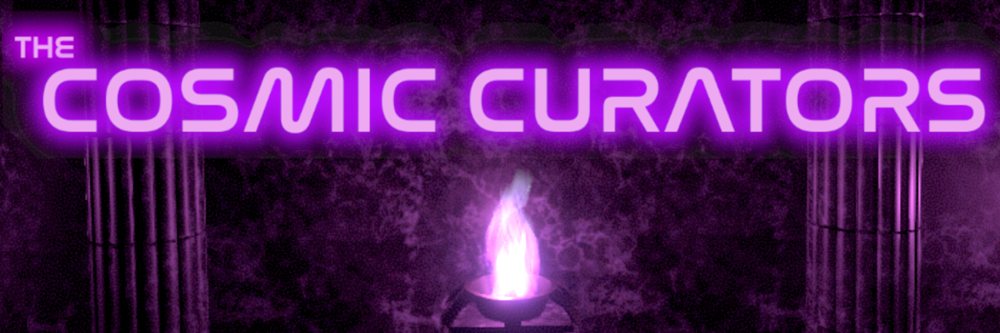

A story mod made for Mod Jam 5 from the people behind **Eyes of the Past**, **Band Together**, **The Stranger They Are**, **Misfired Jump** and **Callis's Thesis**. There is an ominous ship in orbit around a nearby pulsar which appears to not be related to the Nomai or the Stranger's Inhabitants. Dare you lurk around these dark corridors?

This mod requires the [Mod Jam 5 Mod](https://outerwildsmods.com/mods/modjam5/) as a dependency. Outer Wilds Mod Manager should download this automatically, but if it doesn't, download it from the Mod Manager or through this link.

For Developers: To build the mod from source, you will need to already have the mod installed via OWML. Reason being is the Slide Reel Cache is already generated and the AssetBundles are too big to be placed on the GitHub Repository.

Licences: See our [licenses.txt](licenses.txt) file (SPOILERS INSIDE) for references to licenses for things used in the mod (none of them have actual documents).

Signal Jammers Team:
pikpik_carrot - Lead Developer
Anonymous - Programmer
Echatsum/Stache - Programmer
Repcon - 3D Modeling and Design
cOa Rex - Playtester and 2D Art
